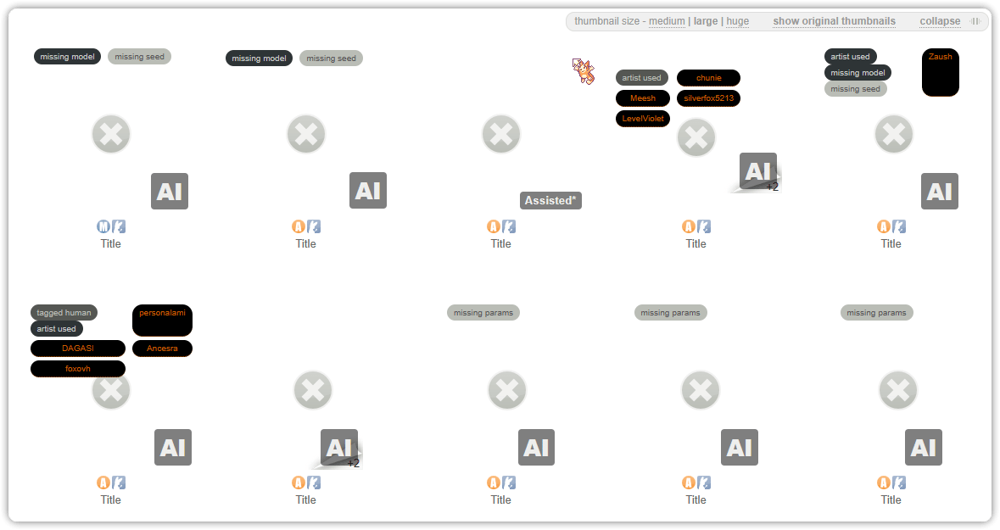

<p align="center">
  
  
  <br>
  <h1 align="center">Inkbunny AI Bridge</h1>
</p>

<p align="center">
  <a href="https://inkbunny.net/">
    
  </a>
  <a href="https://wiki.inkbunny.net/wiki/API">
    
  </a>
  <a href="https://pkg.go.dev/github.com/ellypaws/inkbunny/api">
    
  </a>
  <a href="https://github.com/ellypaws/inkbunny">
    
  </a>
  <a href="https://goreportcard.com/report/github.com/ellypaws/inkbunny-app">
    
  </a>
  <br>
  <a href="https://github.com/ellypaws/inkbunny-app/graphs/contributors">
    
  </a>
  <a href="https://github.com/ellypaws/inkbunny-app/commits/main">
    
  </a>
  <a href="https://github.com/ellypaws/inkbunny-app">
    
  </a>
</p>

--------------

<p align="right"><i>Disclaimer: This project is not affiliated or endorsed by Inkbunny.</i></p>


This project is designed to detect AI-generated images made with stable diffusion in Inkbunny submissions. It processes files and descriptions and uses heuristics to determine if the submission follows the [guidelines](https://wiki.inkbunny.net/wiki/ACP#AI).

By using crafted [heuristics](https://github.com/ellypaws/inkbunny-sd),
as well as the potential to use an LLM to inference the parameters.
A general purpose [API](https://github.com/ellypaws/inkbunny-app) library is available to integrate with your own program logic.

## Inkbunny AI Bridge

The Inkbunny AI Bridge extends the functionality of your browser through a userscript that creates a ticket ready for your review. Based on advanced heuristics, the script prepares everything you need to ensure the content meets Inkbunny's standards.

It displays a badge on each submission to quickly notify you of any potential flagged submission worth verifying.



It constructs a prepared ticket based on the heuristics for you to audit and modify to then submit to Inkbunny.


<details>
<summary>Full api server</summary>

Additionally, there's a [full api server](https://github.com/ellypaws/inkbunny-app/tree/main/cmd/server) that provides additional tools.

A demo app is available either at [https://inkbunny.keiau.space](https://inkbunny.keiau.space/app/audits) or in [retool](https://inkbunny.retool.com).

</details>

## Installation Instructions

> *Make sure you have api turned on in your Inkbunny account settings. You will need your API key and SID to
use the Inkbunny API. You can change this in
your [account settings](https://inkbunny.net/account.php#:~:text=API%20(External%20Scripting))*

There are two parts to the Inkbunny AI Bridge, the [server](#server) and the [userscript](#userscript).

You will need to install a userscript manager extension in your web browser. You can use tampermonkey, greasemonkey or any similar userscript extension.

## Userscript

After installing a userscript manager, you can install the Inkbunny AI Bridge userscript.

1. The current version of the [userscript](scripts/Inkbunny%20AI%20bridge.user.js) is available in [scripts](scripts).
2. Click on the "Raw" button, your userscript manager will recognize this as a userscript and ask for confirmation to install it.
3. Alternatively you can either download or copy the content of the userscript and paste it in your userscript manager.

A simpler [userscript](scripts/Inkbunny%20AI%20detector.user.js) is available if you do need the other features and only want the labelling, blurring or removal of AI generated images.

Todo:
 - [x] Fix blurring and removal of AI generated images (the old script does this but the new one is currently broken) 
 - [ ] Allow editing of the prepared ticket
 - [ ] Highlight more relevant metadata and print generation objects (e.g. model, prompt, etc). Currently you can view this in the console debug.
 - [ ] Better styling

#### Configuring the Userscript

After installing the userscript, you need to configure it to match your server URL. If you're running the server locally, the default URL is `http://localhost:1323`.

1. Open the userscript manager dashboard (Tampermonkey or Greasemonkey).
2. Find the Inkbunny AI Bridge userscript and click on it to edit.
3. Find the line that contains the API URL and replace it with your server URL (e.g., `http://localhost:1323`).
4. Save the changes.

Now, the Inkbunny AI Bridge should be ready to use.

## Server

Set the environment variables for the server to run. You can set the following environment variables:

```bash
export PORT "your_port" # default is 1323
export API_HOST "your_api_host"
export SD_HOST "your_sd_host" # default is "http://localhost:7860"
export REDIS_HOST "your_redis_host" # default is "localhost:6379", when not set, uses local memory cache
export REDIS_PASSWORD "your_redis_password"
export REDIS_USER "your_redis_user" # when not set, uses 'default'

./inkbunny-ai-bridge
```

An optional Redis server can be used for caching.
If not set, it will fall back to local memory cache.
You can always override this behavior for most request by setting the `Cache-Control` header to `no-cache`.

### Building from Source

If you're building from source, you will need to install the dependencies:
Download Go 1.22.3 or later from the [official website](https://golang.org/dl/).

```bash
git clone https://github.com/ellypaws/inkbunny-extension.git
cd inkbunny-extension

go build -o inkbunny-ai-bridge
./inkbunny-ai-bridge
```

You can also use the pre-built binaries from the [releases page](https://github.com/ellypaws/inkbunny-extension/releases).